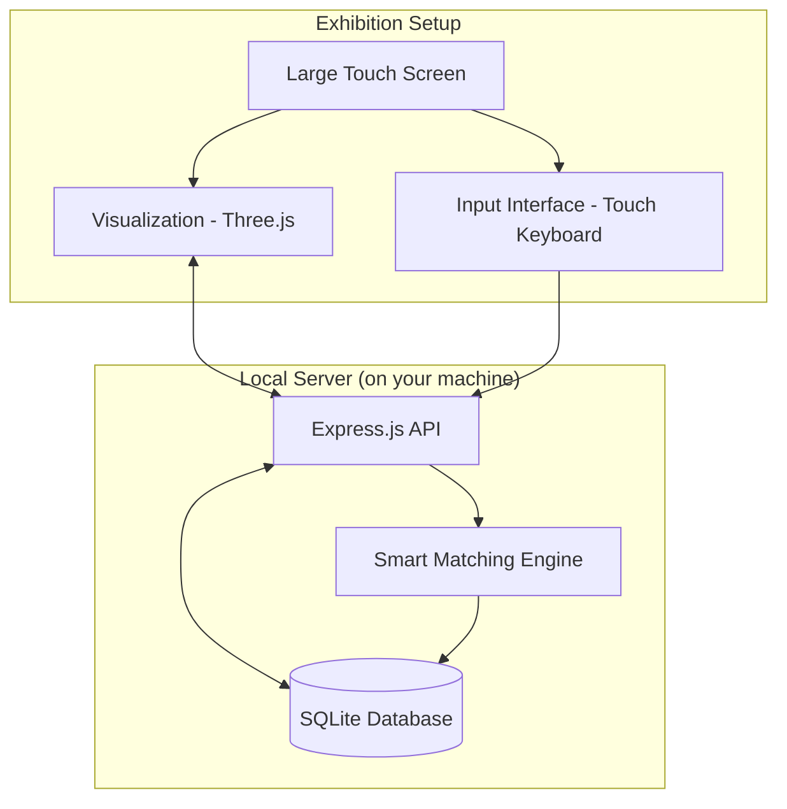

# Six Degrees — Exhibition System Implementation Plan

## Project Vision

A living, organic visualization of human connections displayed on a large touch screen at an exhibition. From afar it looks like an abstract, mesmerizing organism; up close, names, relationships, and paths between people are revealed. Visitors can add themselves and discover how they're connected to everyone else.

---

## Architecture Overview



### Why this stack:
- **SQLite** — Single file database, no setup needed, runs locally on your machine, easy to backup. No cloud, no external services. 100% private.
- **Express.js** — Lightweight local server, handles API + serves the visualization
- **Three.js** (what we have) — The scribble ball visualization
- **Single machine** — Everything runs on one computer at the exhibition

---

## Connection Type Visual Language

| Type | Hebrew | Visual | Line Style |
|---|---|---|---|
| **Immediate Family** | משפחה קרובה | Thick solid line | ━━━━━━ |
| **Extended Family** | משפחה רחוקה | Thin solid line | ────── |
| **Friends** | חברים | Dashed line | ╌ ╌ ╌ ╌ |
| **Acquaintance / Professional** | מכרים / מקצועי | Double thin parallel lines | ══════ |

> [!IMPORTANT]
> These will be rendered via custom GLSL shaders in the line material. Each connection type gets a different `lineType` attribute that the fragment shader interprets to draw the correct pattern.

---

## Data Model

```
Person {
  id: auto-generated
  name: string
  city: string (optional)
  occupation: string (optional)  
  university: string (optional)
  tags: string[] (e.g. ["gaming", "תל אביב", "army"])
  added_by: string (who added this person)
  created_at: timestamp
}

Connection {
  id: auto-generated
  person_a_id: reference
  person_b_id: reference
  type: "immediate_family" | "extended_family" | "friends" | "acquaintance"
  created_at: timestamp
}
```

---

## Phases

### Phase 1: Foundation — Server + Database + Data Import
**Goal**: Get all 150+ people and their connections into a persistent database, served via API.

#### Tasks:
- Set up Node.js + Express project with SQLite
- Create database schema (people + connections)
- Build REST API endpoints:
  - `GET /api/people` — all people
  - `GET /api/people/:id` — single person with their connections
  - `POST /api/people` — add new person
  - `POST /api/connections` — add connection
  - `GET /api/search?q=...` — search by name/tag
  - `GET /api/path/:from/:to` — find shortest path (BFS)
  - `GET /api/suggest?name=...` — smart name matching
- **Excel import script** — parse the Excel file and bulk-insert into SQLite
- API serves the visualization HTML as the frontend

---

### Phase 2: Visualization Upgrade — Dynamic Data + Connection Styles
**Goal**: The scribble ball reads from the API instead of hardcoded arrays, and renders different line styles per connection type.

#### Tasks:
- Fetch people + connections from API on page load
- Dynamically build the particle system from API data (replace hardcoded `userNames` array)
- Implement 4 line styles in the GLSL shader:
  - Thick solid (immediate family)
  - Thin solid (extended family)
  - Dashed (friends)
  - Double parallel (acquaintance/professional)
- Real-time updates: when a new person is added, the organism grows live (WebSocket or polling)
- Tags come from the database instead of hardcoded `userTags` object

---

### Phase 3: Profile Cards + Interaction
**Goal**: Clicking a person opens a detailed card showing their info and connections.

#### Tasks:
- Redesigned info card (right side panel):
  - Name, occupation, city
  - List of direct connections grouped by type
  - "Find Path To..." button
  - Degree of separation from a root person
- Click a connection name in the card → navigate to that person
- Visual highlight of the selected person's direct connections on the scribble ball
- Smooth camera animation to the selected person

---

### Phase 4: Input Interface (Exhibition Kiosk)
**Goal**: Visitors at the exhibition can add themselves via touch screen.

#### Tasks:
- Full-screen input mode with virtual keyboard (touch-friendly)
- Form flow:
  1. "What's your name?" → text input
  2. **Smart matching**: if the name exists, show "Is this you?" with details to confirm
  3. "Where do you live?" → city input
  4. "What do you do?" → occupation
  5. "Who do you know here?" → search existing people, select, and define relationship type
- After submission: cinematic animation of the new node appearing and connecting to the organism
- Smooth transition back to the visualization

---

### Phase 5: Smart Matching + Suggestions
**Goal**: The system identifies possible connections between people.

#### Tasks:
- **Name deduplication**: When someone types a name that's similar to an existing person (fuzzy matching), suggest "Did you mean...?"
- **Connection suggestions**: "You and X both studied at Tel Aviv University — do you know each other?"
  - Based on: same city, same university, same occupation, mutual connections
- Suggestions appear subtly in the UI, not intrusive

---

### Phase 6: Touch Optimization + Exhibition Polish  
**Goal**: Everything works perfectly on a large touch screen.

#### Tasks:
- Touch gestures: pinch-to-zoom, drag to orbit, tap to select
- On-screen virtual keyboard positioned at bottom of screen
- UI elements sized for finger taps (minimum 44px touch targets)
- Auto-return to overview after inactivity (screensaver mode)
- Performance optimization for 300+ nodes

---

## Open Questions

> [!IMPORTANT]
> **Excel file**: I need to see the Excel structure to plan the import. Please share the file path or upload it.

> [!IMPORTANT]  
> **Exhibition timeline**: When is the exhibition? This affects how we prioritize phases.

> [!WARNING]
> **Smart matching complexity**: The "system should understand relationships" feature can range from simple (fuzzy name matching + shared attributes) to very complex (AI-based). For the exhibition, I recommend starting with rule-based matching (shared city/university/mutual friends) — it's reliable and doesn't need external AI services.

> [!NOTE]
> **Phase order**: I recommend building phases 1→2→3→4 sequentially. Phase 5 (smart matching) can be layered in during phase 4. Phase 6 (touch polish) is done last but kept in mind throughout.
